## Event Engine Region - ap-northeast-2 (Seoul)

---


# Create Key pair

1. Login to the AWS Management Console.

---

2. Service => Search window => Move to the EC2


---

3. In the left pane, "Network & Security" => "Key Pairs" Click

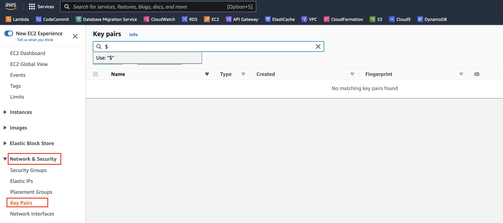

---

4. Click the "Create key pair" button

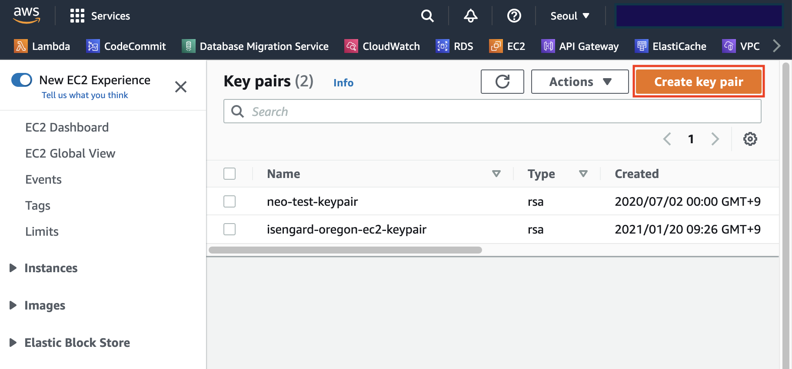

---

5. Name : `DBforMSA` and click the "Create key pair" button

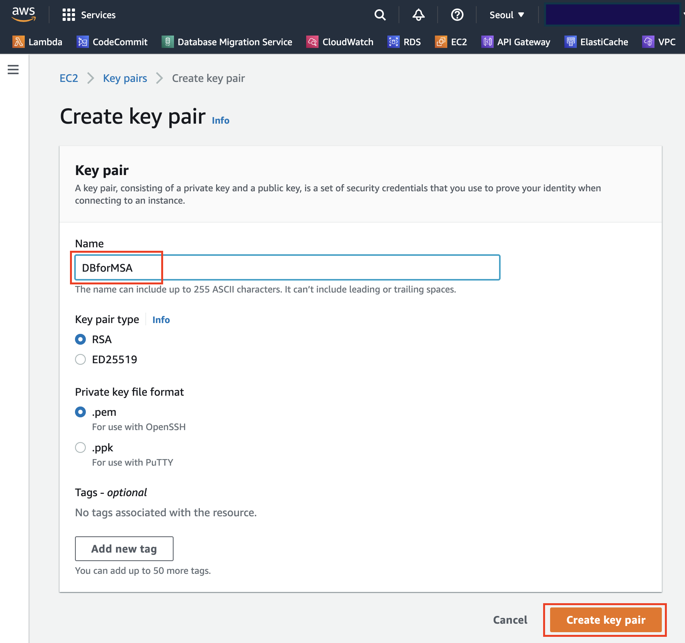

---

6. You can see DBforMSA.cer or DBforMSA.pem file on your computer downloaded.

   This file should be managed securely.

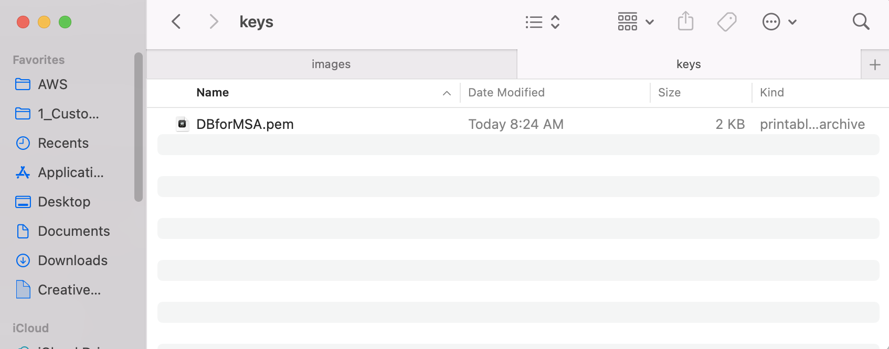

---

7. You can see the key file in the management console.

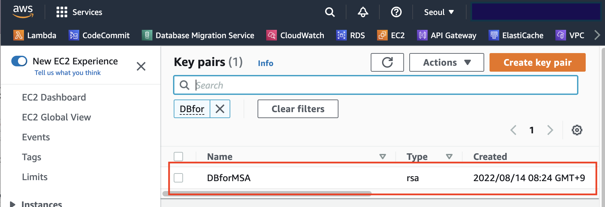


---

---

# Environment Configuration

1. Move to the CloudFormation console.

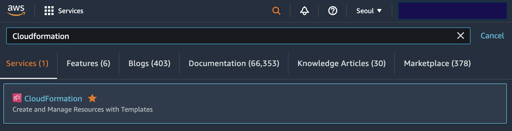

---

2. "Stack" => "Create stack" => "With new resources(standard)"  Click

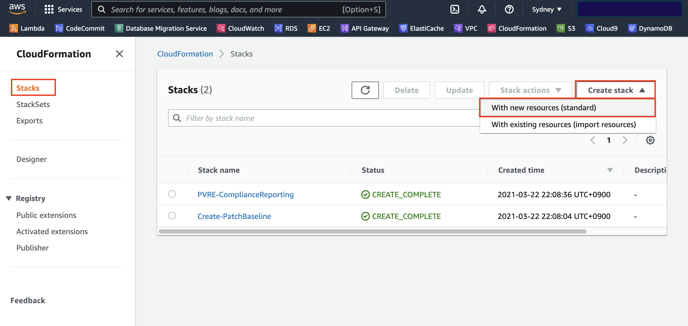

---

3. Enter `https://shared-kiwony.s3.ap-northeast-2.amazonaws.com/OnPREM4.yml` and click "Next"


---

4. Stack name : `DBforMSA`
   KeyName : `DBforMSA`

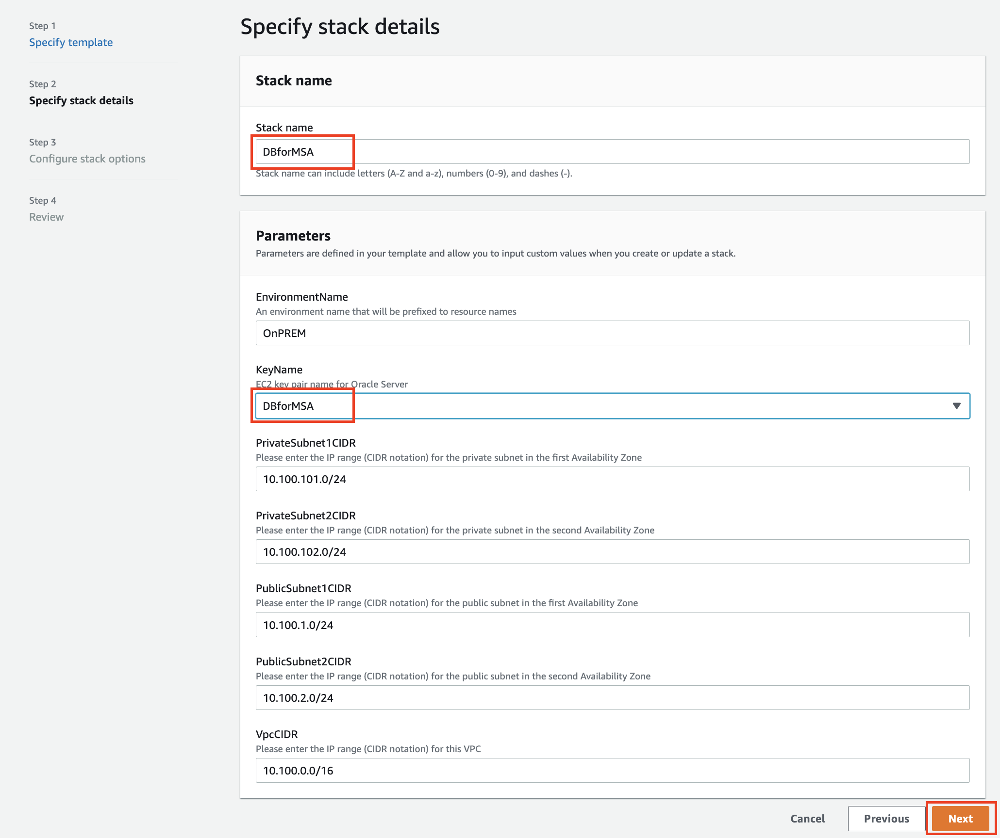

---

5. "Configure stack options" - Click "Next"

6. In the "Review DBforMSA" page, check `I acknowledge that AWS CloudFormation might create IAM resources with custom names.` and click "Create stack"

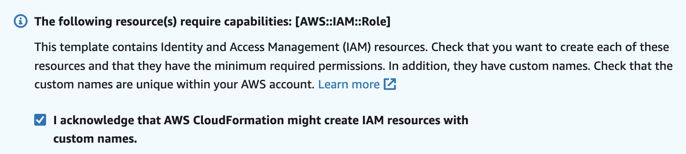

---

7. You can see the progress on the "Events" tab.(It will complete in about 10 minutes.)

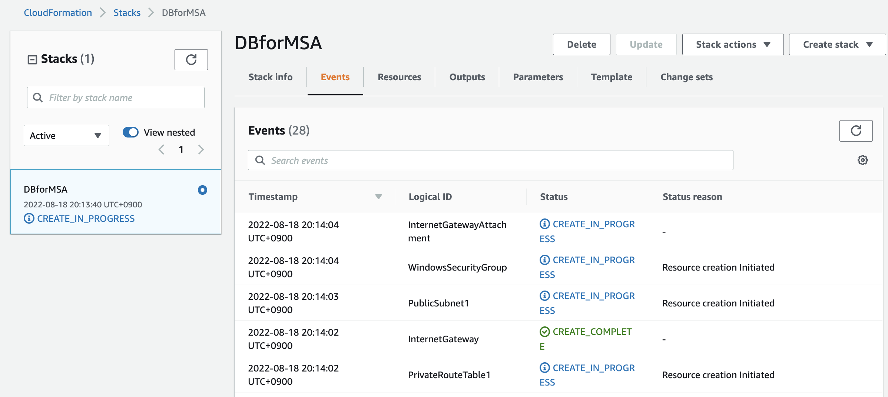


**`CREATE_COMPLTE`**

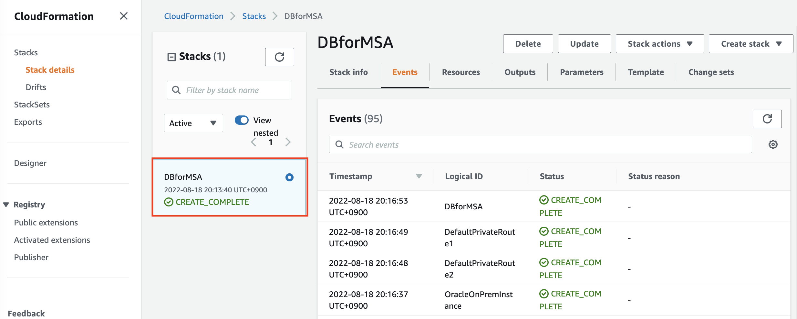

---

---

# Connect to the bastion host server

---

1. CloudFormation => Outputs => `IPWindowsPublicIP`

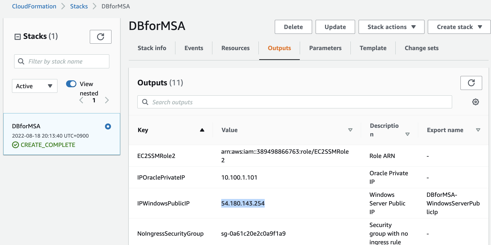

---

2. Connect to the bastion host using "RDP Client"( Windows : mstsc.exe, MAC : Microsoft Remote Desktop)

**Windows Laptop**


**MAC Laptop**


---

3. Connect to the bastion

   ```
   User : Administrator
   Password : Octank#1234
   ```


---

4. Copy `DBforMSA.cer(or DBforMSA.pem)` file downloaded to the bastion server.

**If your pc is a MAC laptop**


**If your pc is a Windows laptop**


**Paste the pem file into C:\keys in the Bastion Server.**


---

5. Execute MobaXterm(SSH Terminal Program).


---

6. Choose "OracleServer" =>  "Edit session"


---

7. Configure the pem key to connect to Oracle server
   1. "Advanced SSH Sessting"
   2. Check "Use private Key"
   3. Click "Open Key"
   4. Move to the "C:\keys"
   5. Chooose the "DBforMSA.cer" and open
   6. "OK" Click


---

8. Connect to the Oracle Server

   **Execute**


**Click Accept**


**You connected the Oracle server**


---

[To the next - workshop01(Separation of CRM Report Service Using MongoDB) ](../workshop01/workshop01.md)
