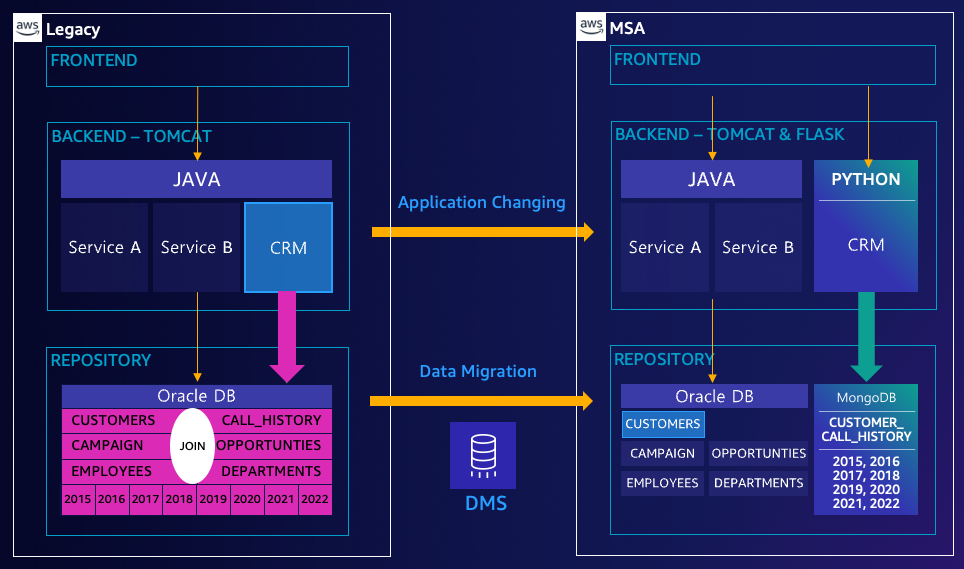
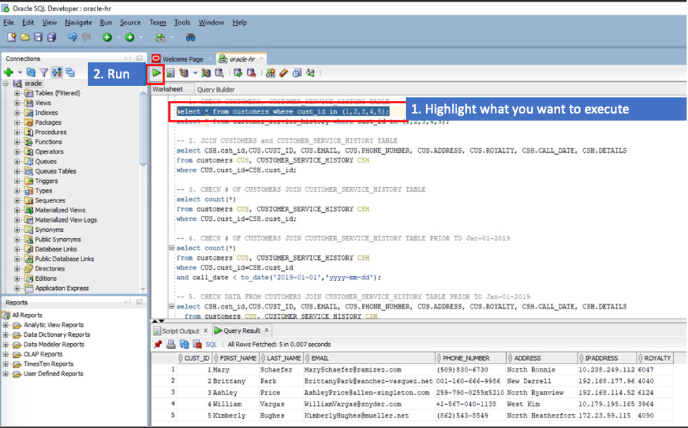
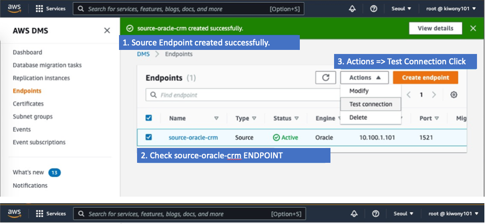
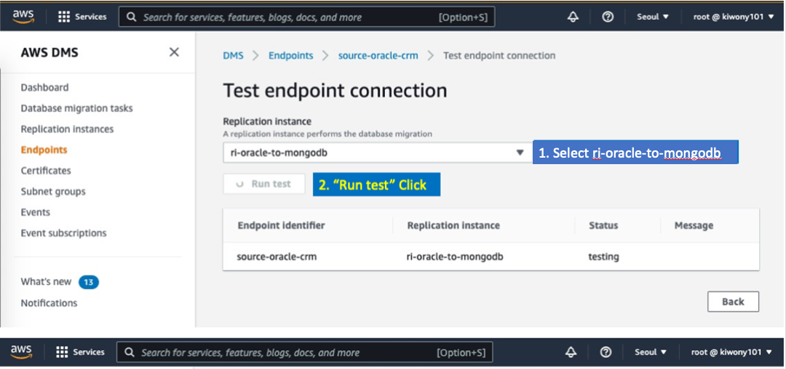
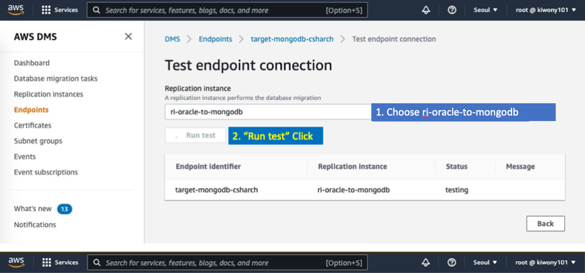
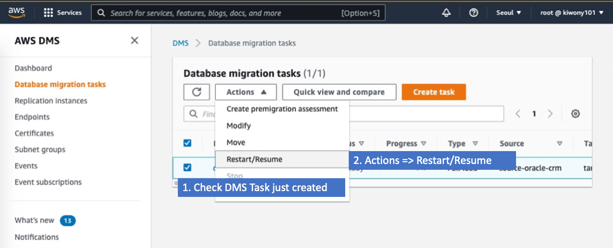
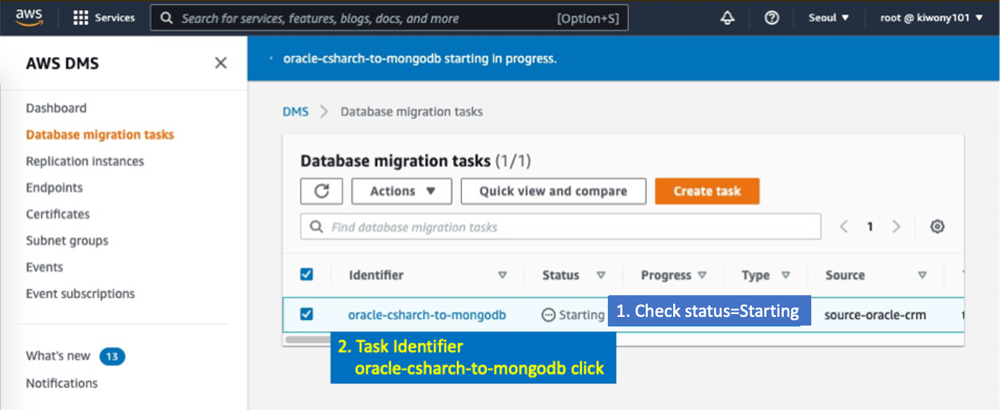

# Workshop01(Separation of CRM Report Service Using MongoDB)


## Transforming Enterprise Monolithic DB to MSA Structure

**Welcome to Workshop1 in Session **

**You will migrate CRM reporting data in Oracle to MongoDB, and learn how application is working with MongoDB**

---

### Architecture Diagram




---

### Scenario 

```
You work for a RETAIL company, and you are a Team Leader who leads the development team and DBA.

The Customer Satisfaction Team uses Legacy CRM systems built in Java and Oracle.
In recent years, systems have accumulated data, resulting in performance degradation issue.
New hired developers also want to use FLASK or JS, which is lighter than Java, for development.

After the meeting with the customer satisfaction team, you found that the data before 2019 among the "CRM - Customer Consultation Data" were used only for simple inquiry.


Traditional Legacy Java applications required joining multiple tables in Oracle to show "customer consultation report".
As a result, each team has the following complaints:

1. DBA: Main Oracle's performance degradation issue because of complexed joining tables to populate "customer consultation report". 

2. Developer: We want to build new application and to deploy it rapidly, but DBA team concerns side-effects such as schema changing result in locking main application. We want to use schemaless database, not to concern  
To increase development efficiency, we want to use schemaless database to develop and to deploy fast.

So you came up with the idea of changing data before 2019 from a multi-joined RDB table structure to a single document form. You thought this would reduce the load and usage of Oracle DB and also allowing developers to develop more flexibly.

So how can you easily transfer complex structured data stored in an existing Oracle to a NoSQL (MongoDB) database?

% CRM reports usually join 6 ~ 14 tables in production environment, but we will only join 2 tables for workshop.
```


# Open 4 new session in MobaXTerm

1. Connecting to Oracle (double click or Execute)


2. Open 4 new Session 


3. Session Rename - `Oracle-HR`, `AP-TOMCAT`, `AP-FLASK`, `MongoDB`


4. Review - Session Name changed 


---

# Migrate Oracle Joined-Table data to MongoDB

1. Executing `SQL Developer` in Bastion Host (It takes 20-30sec to launch at first time)


---

2. Select `oracle-hr`, then click right mouse butto, then execute `Connect`


---

3. Open `Query3.txt` on desktop in bastion


---

4. Copy all contents in Query3.txt, then paste it to `worksheet in SQL developer`


---

5. Run Query 1 ~ Query 5 to check CRM DB data in Oracle

```
Query 1 : CHECK CUSTOMERS, CUSTOMER_SERVICE_HISTORY TABLE

Query 2 : JOIN CUSTOMERS and CUSTOMER_SERVICE_HISTORY TABLE
(CRM reports usually join 6 ~ 14 tables in production environment, but we will only join 2 tables for workshop.)

Query 3 : CHECK # OF CUSTOMERS JOIN CUSTOMER_SERVICE_HISTORY TABLE

Query 4 : CHECK # OF CUSTOMERS JOIN CUSTOMER_SERVICE_HISTORY TABLE PRIOR TO Jan-01-2019
-- 4286rows

Query 5 : CHECKING DATA FROM CUSTOMERS JOIN CUSTOMER_SERVICE_HISTORY TABLE PRIOR TO Jan-01-2019

```

% How to execute : 

1. Highlight what you want to execute
2. Click Run Statement




---

6. Let's create **Materialized View** to migrate data prior to 1st-Jan-2019 that we already checked in Query 5

   Run **Query 6** (Takes 10~15sec to create MVIEW)
   
   Now you have MVIEW -  `CSHARCH` , and you will migrate `CSHARCH` data into MongoDB. 
   
   % If you want to migrate all data not only data prior to 2019, you just need to create MVEIW with no where condition. 

```
-- Creating MVIEW that includes joined data between CUSTOMERS and CUSTOMER_SERVICE_HISTORY prior to 1st-Jan-2019
-- For CRM report, application joins 6~14 tables, but we only join 2 tables for workshop.

create MATERIALIZED VIEW CSHARCH
  NOLOGGING
  CACHE
  BUILD IMMEDIATE 
  REFRESH ON DEMAND
  as
  select CSH.csh_id,CUS.CUST_ID, CUS.EMAIL, CUS.PHONE_NUMBER, CUS.ADDRESS, CUS.ROYALTY, CSH.CALL_DATE, CSH.DETAILS 
  from customers CUS, CUSTOMER_SERVICE_HISTORY CSH
  where CUS.cust_id=CSH.cust_id
  and call_date < to_date('2019-01-01','yyyy-mm-dd');
```


---

7. Execute `Chrome` in `Bastion Server`, and Click `CRM-LIST` in Favorite bar.

   You will see **Legacy java application** that is connecting to `Oracle DB`. 

   Let's check CRM  data of customer #1 - **Mary Schaefer**. 

   % **Customer Satisfaction** Page shows history data from `CUSTOMERS` and `CUSTOMER_SERVICE_HISTORY` .


---

8. Let's migrate data prior to 1st-Jan-2019 in CRM.

   Then you will change CRM application from **legacy java application** - `crs-show.jsp` to **Python Flask application**. 

   First of all, you are going to migrate **Oracle data** to **MongoDB**. 


```
You are going to migrate data from Oracle to MongoDB using DMS(Database Migration Service). 
Data migration by DMS are consists of 4 steps. 
Data 이관은 크게 아래 3가지 작업을 통해서 이뤄집니다.

1. Create Replication Instance : Replication instance will migrate data from source to target.
2. Create Source ENDPOINT : Endpoint for source Oracle DB to read data
3. Create Target ENDPOINT : Endpoint for target MongoDB to write data
4. Create DMS Tasks
  - Choosing schema and table that to read from Source and Choosing collection to write to Target.
```


---

9. Move to **Database Migration Service** in AWS Console. (You need to use your labtop, not in Bastion.)


---

10. Create **Replication Instance** 

Click **Replication Instances** 

Click **Create Replication Instances**


Enter the following information for the **Replicatin Instance**. Then, Click on the **Create** Button. 


```
Name : ri-oracle-to-mongodb
Description : Replication Instance for Migration
Instance class : dms.t3.small or dms.t3.medium or dms.t3.large
Engine Version : 3.4.6
Allocated Storage : 50
VPC : OnPREM
Multi AZ : Dev
Publicly accessible : Uncheck
```


Wait for creating replication instance. **ri-oracle-to-mongodb** will be Available, then go to next step. (It taeks approx. 5min)


---

11. Create **Source ENDPOINT for Oracle** to read data

    Click **Endpoints**

    Click **Create endpoint**


Enter the following information for the **Source Endpoint**. Then, Click on the **Create endpoint** Button. 

```
Endpoint Type : Source endpoint

Endpoint Identifier : source-oracle-crm
Source Engine : Oracle

Access to endpoint database : Provide access information manually
Server Name : 10.100.1.101
Port : 1521
User name : dms
Password : dms
SID/Service name : XE

% You have to complete some pre-requirements such as 'create user' or 'grant some permission' to use DMS.
% You can see the details in https://docs.aws.amazon.com/dms/latest/userguide/CHAP_Source.Oracle.html
% Or you can see command in Query2.txt on desktop in bastion server.
```


Check connectivity between **Source Endpoint** and **Replication Instance**






---

12. Create **Target ENDPOINT for MongoDB** to write data


Enter the following information for the **Target Endpoint**. Then, Click on the **Create endpoint** Button. 

```
Endpoint Type : Target endpoint

Endpoint Identifier : target-mongodb-csharch
Target Engine : Amazon DocumentDB (with MongoDB compatibility)

Access to endpoint database : Provide access information manually
Server Name : 10.100.1.101
Port : 27017
User name : myadmin
Password : Welcome1234
Database Name : crm

% In this workshop, we are using same server for both of Oracle and MongoDB to reduce cost.
% You can use standalone for DEV/Test env, it's better to use Amazon DocumentDB or MongoDB Atlas 
% to secure HA, Security, auto backup and operational excellence in Production env.

```


Check connectivity between **Target Endpoint** and **Replication Instance**





---

13. Create **DMS Task** to choose **Schema/Table and Collection**

    Click **Datagase migration tasks**

    Click **Create task**


Enter the following information for the **Task**. Then, Click on the **Create task** Button. 

**Task configuration**

```
Task identifier : oracle-csharch-to-mongodb
Replication instance : ri-oracle-to-mongodb
Source database endpoint : source-oracle-crm
Target database endpoint : target-mongodb-csharch
Migration type : Migrate existing data

```

**Task setting**

```
Target table preparation modeInfo : Drop tables on target
Include LOB columns in replication : Limited LOB mode 
Enable CloudWatch logs: Check Enable
```

**Table mappings - (Choose Schema / Table to be migrated)**

```
"Add new selection rule" Click

Schema : Enter a schema
Schema name : HR
Table name : CSHARCH
Action : include

% Choose SCHEMA - HR, Table - CSHARCH(MVIEW CRM data prior to 2019) 
```

**Migration task startup configuration**

```
Start migration task : Manually later
```


Wait till **Task status** is **Ready**


Start Task - **Actions** => **Restart/Resume**





Click **Task Identifier** - **oracle-csh-to-mongodb** to monitor migration status




Click **Table statiscis** tab to monitor migration status. DMS will migrate all data - 4286 rows shortly.


---

14. Let's connect to MongoDB to validate data. 

    Connecting to **Bastion Server** using **mstsc.exe** in windows or **remote desktop** in Mac. 

---

15. Go to **MongoDB** Session in MobaXterm 

---

16. **Execute** the following statement to count data.

    **Validate** CSHARCH collection has to have 4286 documents.

    **Validate** the datas are prior to 1st-Jan-2019.

    
    

**MongoDB Statement**

```
mongoadmin
use crm
show collections
db.CSHARCH.find().count()
db.CSHARCH.find({},{CUST_ID:1,EMAIL:1,CALL_DATE:1}).sort({CALL_DATE:+1}).limit(1)
db.CSHARCH.find({},{CUST_ID:1,EMAIL:1,CALL_DATE:1}).sort({CALL_DATE:-1}).limit(1)
```

**MongoDB Statement and output example**

```


## Command Output
ec2-user@ip-10-100-1-101:/home/ec2-user> mongoadmin
MongoDB shell version v4.4.12
connecting to: mongodb://127.0.0.1:27017/?authSource=admin&compressors=disabled&gssapiServiceName=mongodb
Implicit session: session { "id" : UUID("7904e03b-796a-4698-a088-cbc4d901ccd3") }
MongoDB server version: 4.4.12
> use crm
switched to db crm
> show collections
CSHARCH
> db.CSHARCH.find().count()
4286
> db.CSHARCH.find({},{CUST_ID:1,EMAIL:1,CALL_DATE:1}).sort({CALL_DATE:+1}).limit(1)
{ "_id" : ObjectId("620c930a0e83f26aca4a85e7"), "CUST_ID" : "8424", "EMAIL" : "KevinClayton@vance.com", "CALL_DATE" : ISODate("2016-08-19T14:21:58Z") }
> db.CSHARCH.find({},{CUST_ID:1,EMAIL:1,CALL_DATE:1}).sort({CALL_DATE:-1}).limit(1)
{ "_id" : ObjectId("620c930a0e83f26aca4a8461"), "CUST_ID" : "7850", "EMAIL" : "JasonRobinson@taylor-jennings.com", "CALL_DATE" : ISODate("2018-12-31T14:21:56Z") }
>


% check mongoadmin aliasing
ec2-user@ip-10-100-1-101:/home/ec2-user> alias |grep mongoadmin
alias mongoadmin='mongo -u myadmin -p Welcome1234   --authenticationDatabase "admin"'
```


---

17. You've just completed data migration.

    Let's **change the application** from **legacy java application** to **python flask application**

    Go to **AP-FLASK Session** in MobaXterm

---

18. **Execute** the following commands to run **Flask application**.

```
ec2-user@ip-10-100-1-101:/home/ec2-user> cd workshop01
ec2-user@ip-10-100-1-101:/home/ec2-user/workshop01> source bin/activate
(workshop11) ec2-user@ip-10-100-1-101:/home/ec2-user/workshop11> flask run --host=0.0.0.0
 * Environment: production
   WARNING: This is a development server. Do not use it in a production deployment.
   Use a production WSGI server instead.
 * Debug mode: off
 * Running on all addresses.
   WARNING: This is a development server. Do not use it in a production deployment.
 * Running on http://10.100.1.101:5000/ (Press CTRL+C to quit)

```


---

19. Click **FLASK-1** from favorite in **Chrome** as following. 

    You can see the CRM history data from MongoDB

    % FLASK-1 shows customer #1 **Mary Schaefer** 's CRM history


---

20. Click **FLASK-4** to see customer 4 from favorite in **Chrome** as following. 


---

21. Go to MobaXterm, then press **crtl+c** to terminate Flask application

---

22. Let's see the code of Flask applcation as following

    


New Flask application retreives data from MongoDB using API - **FIND()** with given parameter, 

then returns page to render HTML using **render_template()**. 

```
import sys
import time
import json
from flask import Flask, request, render_template
from pymongo import MongoClient
from bson.objectid import ObjectId
import urllib.parse
from bson import json_util
from flask import jsonify
from datetime import date
from bson.json_util import loads
from bson.json_util import dumps

## Connection String for MongoDB, credential hard coding is high risky.
## This is only for workshop, MUST use AWS SECRET MANAGER to PROTEST YOUR SYSTEM
username = urllib.parse.quote_plus('myadmin')
password = urllib.parse.quote_plus('Welcome1234')
client = MongoClient('mongodb://%s:%s@10.100.1.101' % (username, password))

db = client.crm
collection = db.CSHARCH

app = Flask(__name__, static_url_path='')
@app.route('/', methods=['GET'])
def index():
     return 'This is index page'
@app.route('/select', methods=['GET'])
def select():
    paramCustID = request.args.get("CUST_ID")
    docs = list(collection.find({"CUST_ID" : paramCustID},{"_id":0,"CUST_ID": 1,"EMAIL": 1, "PHONE_NUMBER": 1, "ROYALTY": 1, "CALL_DATE": 1,"DETAILS" :1}))

    return render_template(
                'ShowDetails.html',
                pCustID=docs[0]['CUST_ID'],
                pEmail=docs[0]['EMAIL'],
                pPhoneNumber=docs[0]['PHONE_NUMBER'],
                pRoyalty=docs[0]['ROYALTY'],
                pCallDate=docs[0]['CALL_DATE'],
                #pDetails=docs[0]['DETAILS']
                pDetails=docs[0]['DETAILS'].replace("\\n","<BR><BR>")
            )

if __name__ == '__main__':
 if len(sys.argv) > 1:
     app.debug = True
     app.jinja_env.auto_reload = True
     app.config['TEMPLATES_AUTO_RELOAD'] = True
     app.run(host='0.0.0.0', port=4000)
 else:
     #select();
     app.run(host='0.0.0.0')

```

---

```
Now you've just migrated complexed joined Oracle data to MongoDB using DMS.
New application uses MongoDB to retrieve document type data, so no need to query multiple times and no need to join tables.

The migration results in reducing overhead from Oracle to remove heavy join opration, 
and developers is able to develop and deploy quickly and easily to use schema-less MongoDB.

```

---

```

% In this workshop, we are using same server for both of Oracle and MongoDB to reduce cost.
% You can use standalone for DEV/Test env, it's better to use Amazon DocumentDB or MongoDB Atlas 
% to secure HA, Security, auto backup and operational excellence in Production env.

```

---

[Go to Next Workshop - workshop02(Building real time leader board using REDIS) ](../workshop02/workshop02.md) 


