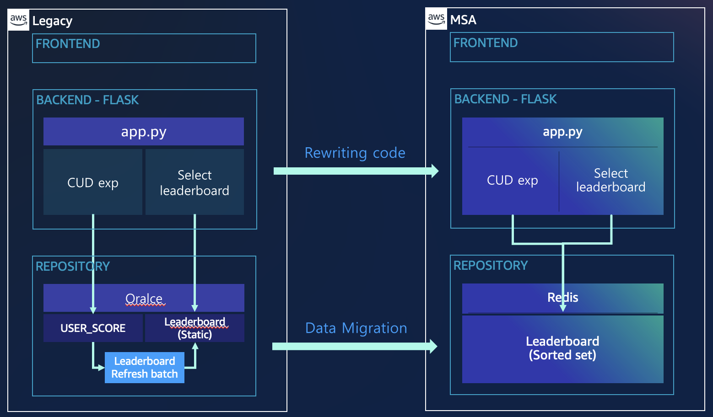
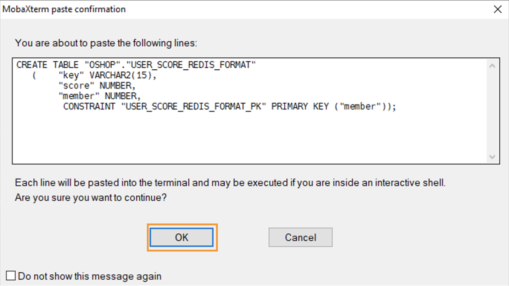
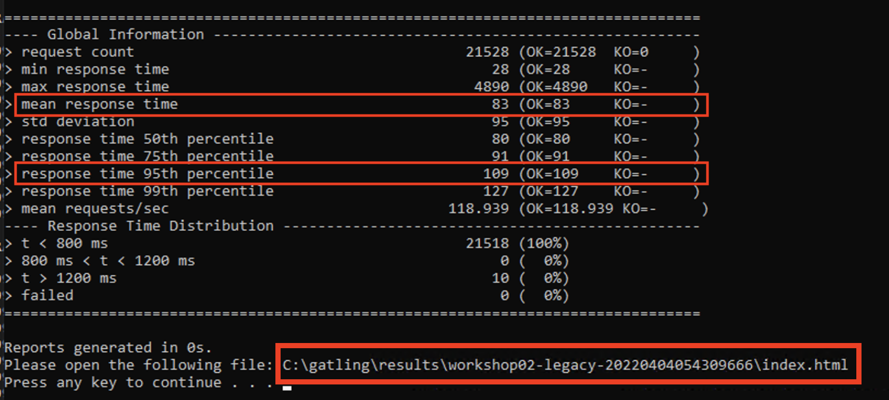
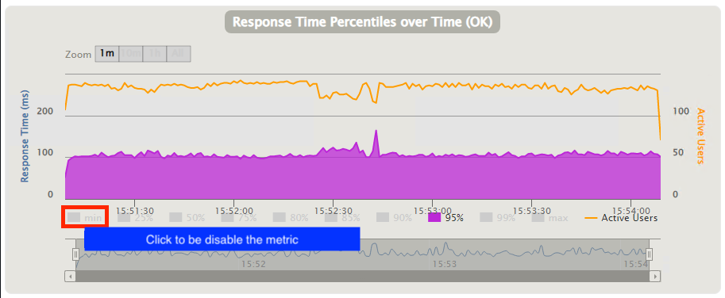
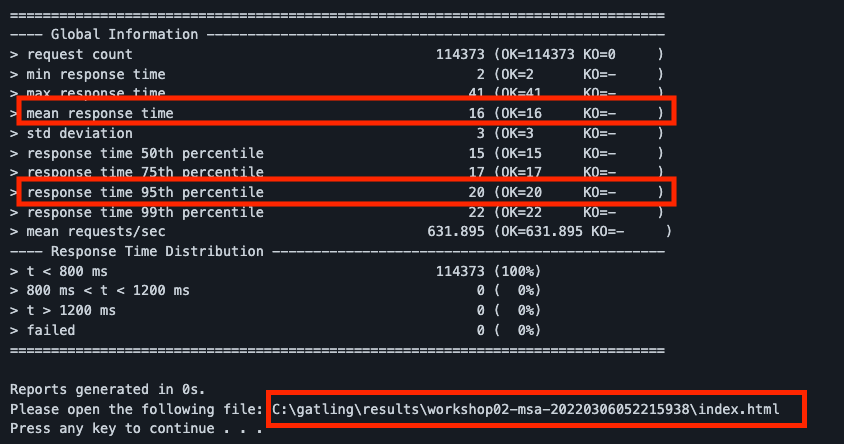
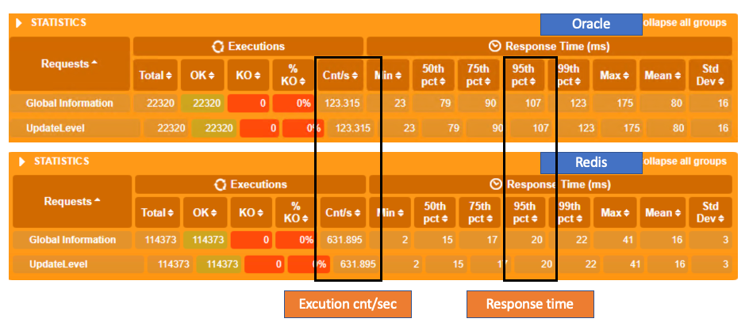

# Workshop02(Real time leaderboard with Redis)


Welcome to Workshop2. In this workshop, you wiil learn how to migrage data from Oracle to Redis and how to build real time leaderboard service on Redis.

---

### Architecture Diagram


---

### User story
```
You are a database engineer and in charge of the database for leaderboard service.

It is hard to retain leaderboard data in the latest  because making it needs a lot of system resources and might cause  the unstable system.
So you set an seperate database server to make leaderboard data by batch processing and moved it to the source Oracle databse server.

However, as the number of users increased, it was taking more and more time to create data.
Recently, the demands for real-time leaderboard is increasing.

To solve this problem, you decided to mirate data from Oracle to Redis.
```
---

# Open four MobaXterm sessions.

1. You can find the way how to make a session at the Workshop01.
2. Change the name of session. (`Oracle`,`Redis`,`Legacy_server`, `MSA_server`)


---

# Migrate data from Oracle to Redis

1. Move to the `Oralce` session at the MobaXterm.   
   Connect the oracle database via SQLPLUS and execute the leaderboard select query.   
   You can see the 300,000 data sorted by both USERLEVEL and EXPOINT columns.
```
ec2-user@ip-10-100-1-101:/home/ec2-user> sudo su -
Last login: Tue Feb  8 06:07:37 UTC 2022 on pts/0
root@ip-10-100-1-101:/root# su - oracle
Last login: Tue Feb  8 06:07:44 UTC 2022 on pts/0
oracle@ip-10-100-1-101:/home/oracle> sqlplus oshop/oshop

SQL*Plus: Release 11.2.0.2.0 Production on Tue Feb 8 06:12:37 2022

Copyright (c) 1982, 2011, Oracle.  All rights reserved.


Connected to:
Oracle Database 11g Express Edition Release 11.2.0.2.0 - 64bit Production

SQL> SELECT userid, rank() OVER (ORDER BY USERLEVEL DESC, EXPOINT DESC) AS rank FROM USER_SCORE;
...
    USERID       RANK
---------- ----------
    260091     299982
      6205     299983
    192037     299984
    220661     299985
    144834     299986
    110780     299987
      6474     299988
    128521     299989
    231474     299990
    110140     299991
     52016     299992

    USERID       RANK
---------- ----------
    162246     299993
    187240     299994
    188193     299995
    225220     299996
    152497     299997
    117736     299998
     86425     299999
    245984     300000

300000 rows selected.

SQL>
```
---

2. Create a table to store the data for migration.   
   Execute the query below on SQLPLUS to insert data into the table.

```
CREATE TABLE "OSHOP"."USER_SCORE_REDIS_FORMAT" 
   (	"key" VARCHAR2(15), 
	"score" NUMBER, 
	"member" NUMBER, 
	 CONSTRAINT "USER_SCORE_REDIS_FORMAT_PK" PRIMARY KEY ("member"));

INSERT INTO USER_SCORE_REDIS_FORMAT
SELECT 'leaderboard' AS key,  
	userlevel||LPAD(expoint, 13, '0') AS score,
	USERID AS MEMBER
FROM USER_SCORE us;

commit;
```

<span style="color:#088A68"><b>Click OK button on the popup below.</b></span>



If the result is normal, you can see the screen below.


---

3. Make a CSV file using the data you made in previous step.   
   Move to the `MSA_Server` session in MobaXTerm and execute the script below.

~~~
ec2-user@ip-10-100-1-101:/home/ec2-user> cd workshop02/msa
ec2-user@ip-10-100-1-101:/home/ec2-user/workshop02/msa> sudo su -
Last login: Sun Mar  6 03:28:55 UTC 2022 on pts/3
root@ip-10-100-1-101:/root# su - oracle
Last login: Sun Mar  6 03:28:58 UTC 2022 on pts/3
oracle@ip-10-100-1-101:/home/oracle> cd workshop02
oracle@ip-10-100-1-101:/home/oracle/workshop02> sh 01-unload-data.sh
oracle@ip-10-100-1-101:/home/oracle/workshop02> ls
01-unload-data.sh  unload_user_score.sql  user_score.csv
oracle@ip-10-100-1-101:/home/oracle/workshop02> tail user_score.csv
leaderboard,     941645071728030,                              296488
leaderboard,     931645071728030,                              296489
leaderboard,     251645071728030,                              296490
leaderboard,     121645071728030,                              296491
leaderboard,     151645071728030,                              296492
leaderboard,     961645071728030,                              296493
leaderboard,     771645071728030,                              296494
leaderboard,     601645071728030,                              296495
leaderboard,     91645071728030,                               296496
leaderboard,     211645071728030,                              296497
~~~
---

4. Migrate user_score.csv data into Redis.     
   Execute the script below at the `MSA_Server` session.

~~~
oracle@ip-10-100-1-101:/home/oracle/workshop02> exit
logout
root@ip-10-100-1-101:/root# exit
logout
ec2-user@ip-10-100-1-101:/home/ec2-user/workshop02/msa> sh 01-copy-score.sh
ec2-user@ip-10-100-1-101:/home/ec2-user/workshop02/msa> sh 02-transform.sh
ec2-user@ip-10-100-1-101:/home/ec2-user/workshop02/msa> sh 03-load-data-to-redis.sh
Warning: Using a password with '-a' or '-u' option on the command line interface may not be safe.
All data transferred. Waiting for the last reply...
Last reply received from server.
errors: 0, replies: 300000
~~~
Please refer the description of the script below.
```
### 01-copy-score.sh : Copy the file.
ec2-user@ip-10-100-1-101:/home/ec2-user/workshop02/msa> cat 01-copy-score.sh
sudo cp /home/oracle/workshop02/user_score.csv /home/ec2-user/workshop02/msa/user_score.csv
sudo chown ec2-user:ec2-user /home/ec2-user/workshop02/msa/user_score.csv

### 02-transform.sh : Convert raw data in the csv file to Redis command.
ec2-user@ip-10-100-1-101:/home/ec2-user/workshop02/msa> cat 02-transform.sh
awk -F "," 'NR > 0{ print "ZADD "$1" "$2" "$3}' ./user_score.csv > redis-load.cmd

### 03-load-data-to-redis.sh : Load data into redis using redis-cli.
ec2-user@ip-10-100-1-101:/home/ec2-user/workshop02/msa> cat 03-load-data-to-redis.sh
cat redis-load.cmd | redis-cli -a Welcome1234 --pipe

```


---

5. Check data migrated in Redis. 
    * zcard leaderboard : Return the number of members in key 
    * zrevrange leaderboard 0 9 : Return 10 items of data sorted 

~~~
ec2-user@ip-10-100-1-101:/home/ec2-user/workshop02/msa> redis-cli -a Welcome1234
Warning: Using a password with '-a' or '-u' option on the command line interface may not be safe.
127.0.0.1:6379> zcard leaderboard
(integer) 300000
127.0.0.1:6379> zrevrange leaderboard 0 9
 1) "299830"
 2) "299827"
 3) "299472"
 4) "299265"
 5) "299209"
 6) "298755"
 7) "298525"
 8) "298502"
 9) "298233"
10) "298162"
127.0.0.1:6379> zrevrank leaderboard 299830
(integer) 0
127.0.0.1:6379> exit
ec2-user@ip-10-100-1-101:/home/ec2-user/workshop02/msa>
~~~
---

# Checking how much the leaderboard select query affect Oracle

1. Execute the leaderboard application that use Oracle database.   
   Move to the `Legacy_server` session in MobaXterm and enter the script below.
```
ec2-user@ip-10-100-1-101:/home/ec2-user> cd workshop02/legacy
ec2-user@ip-10-100-1-101:/home/ec2-user/workshop02/legacy> source bin/activate
(legacy) ec2-user@ip-10-100-1-101:/home/ec2-user/workshop02/legacy> flask run --host=0.0.0.0 --port=4000
 * Environment: production
   WARNING: This is a development server. Do not use it in a production deployment.
   Use a production WSGI server instead.
 * Debug mode: off
 * Running on all addresses.
   WARNING: This is a development server. Do not use it in a production deployment.
 * Running on http://10.100.1.101:4000/ (Press CTRL+C to quit)
```

---

2. Let's see the impact of executing the rank() qeury.   
   [Gatling](https://gatling.io/) generates the requests for updating level and score.   
   In the meantime you are going to execute rank() function.

   Click the icon to open `Command Prompt` in the Windows `Bastion Server`.
      

   Enter the scripts below in the command prompt.
   The request from Gatling will retain for 3 minutes.   

```
C:\Users\Administrator> CD C:\gatling\bin
C:\gatling\bin> gatling.bat
GATLING_HOME is set to "C:\gatling"
JAVA = "java"
Choose a simulation number:
     [0] SeoulSummit.Workshop02_legacy
     [1] SeoulSummit.Workshop02_msa
     [2] SeoulSummit.Workshop04_legacy
     [3] SeoulSummit.Workshop04_msa
0(Enter)
Select run description (optional)
(Enter)
Simulation SeoulSummit.Workshop2_legacy started...

================================================================================
2022-03-06 15:51:14                                           5s elapsed
---- Requests ------------------------------------------------------------------
> Global                                                   (OK=601    KO=0     )
> UpdateLevel                                              (OK=601    KO=0     )

---- Workshop02_legacy ---------------------------------------------------------
          active: 9      / done: 601
================================================================================
```
You call rank() function in Oracle during updating requests are in progress.   
Execute the script below in `Oracle` session in MobaXterm.   

``` sql
# This query makes data ordered by USERLEVEL and EXPOINT. You can find out the ranking of user from this data.
SQL> SELECT userid, rank() OVER (ORDER BY USERLEVEL DESC, EXPOINT DESC) AS rank FROM USER_SCORE;
```
   


You can see the test result.

   

Open the web site from the link above and see the test result.

**The result shows us that the requests dropped during excuting rank() function.**
**The more data, the more resource uses and this increases database overhead.**





Move to the `Legacy_server` session and enter `CTRL+C` to stop the application.
```
10.100.1.103 - - [08/Feb/2022 06:28:07] "GET /legacy/updateuserlevel HTTP/1.1" 200 -
^C(legacy) ec2-user@ip-10-100-1-101:/home/ec2-user/workshop2/legacy>
```
---

# Let's test on Redis

1. Move to the `MSA_server` session and execute the leaderboard service using Redis.
```
ec2-user@ip-10-100-1-101:/home/ec2-user/workshop02/msa> source bin/activate
(msa) ec2-user@ip-10-100-1-101:/home/ec2-user/workshop02/msa> flask run --host=0.0.0.0 --port=4000
 * Environment: production
   WARNING: This is a development server. Do not use it in a production deployment.
   Use a production WSGI server instead.
 * Debug mode: off
 * Running on all addresses.
   WARNING: This is a development server. Do not use it in a production deployment.
 * Running on http://10.100.1.101:4000/ (Press CTRL+C to quit)
```
---

2. Let's see the impact of executing the zrevrange function.   
   [Gatling](https://gatling.io/) generates the requests for updating level and score.   
   In the meantime you are going to execute zrevrange function.

   The leaderboard data is changed and you can excute the zrevrange without overhead on Redis.   
   So you can serve real time leaderboard service to your customer.   
   Click the icon to open `Command Prompt` in the Windows `Bastion Server`.
      

```
C:\Users\Administrator> CD C:\gatling\bin
C:\gatling\bin> gatling.bat
GATLING_HOME is set to "C:\gatling"
JAVA = "java"
Choose a simulation number:
     [0] SeoulSummit.Workshop02_legacy
     [1] SeoulSummit.Workshop02_msa
     [2] SeoulSummit.Workshop04_legacy
     [3] SeoulSummit.Workshop04_msa
1(Enter)
Select run description (optional)
(Enter)
Simulation SeoulSummit.Workshop2_legacy started...

================================================================================
2022-03-06 14:22:22                                           5s elapsed
---- Requests ------------------------------------------------------------------
> Global                                                   (OK=3034   KO=0     )
> UpdateLevel                                              (OK=3034   KO=0     )

---- Workshop02_msa ------------------------------------------------------------
          active: 10     / done: 3034
================================================================================
```
---

3. Move to the `Redis` in MobaXterm.   
   Excute the script below and check the result.   
   `zrevrange leaderboard 10000 10010` returns the data ranked between 10000th ~ 10010th.   
    
    You can make the real time leaderboard service simply through sorted set of Redis.

```
ec2-user@ip-10-100-1-101:/home/ec2-user/workshop02/msa> redis-cli -a Welcome1234
127.0.0.1:6379> zrevrange leaderboard 10000 10010
 1) "25408"
 2) "144669"
 3) "91035"
 4) "43661"
 5) "158444"
 6) "92597"
 7) "144895"
 8) "142565"
 9) "962"
10) "56587"
11) "18594"
127.0.0.1:6379> zrevrange leaderboard 10000 10010
 1) "78525"
 2) "36589"
 3) "74403"
 4) "184208"
 5) "155603"
 6) "65338"
 7) "277657"
 8) "209997"
 9) "29455"
10) "20594"
11) "81012"
```
---

4. You can check the test result.   
The result show you better performance than Oracle test.   
      
  
    

---

  

5. Open the web site from the link above and see the test result.  
   The average latency of p95 is 20ms and the impact of zrevrange function is very low.
  
    
    
    

Move to the `MSA_server` session and enter `CTRL+C` to stop the application.
```
10.100.1.103 - - [07/Apr/2022 13:00:38] "GET /msa/updateuserlevel HTTP/1.1" 200 -
^C(msa) ec2-user@ip-10-100-1-101:/home/ec2-user/workshop02/msa> 
```

# Recap
## Performance improvement for the leaderboard service
Reponse time and excution count in Redis are improved about 5 times better than Oracle.

## Real-time leaderboard
The result of zrevrange command below shows that the userid from 10000th to 10010th place is refreshing in real-time.
```
127.0.0.1:6379> zrevrange leaderboard 10000 10010
 1) "25408"
 2) "144669"
 3) "91035"
 4) "43661"
 5) "158444"
 6) "92597"
 7) "144895"
 8) "142565"
 9) "962"
10) "56587"
11) "18594"
127.0.0.1:6379> zrevrange leaderboard 10000 10010
 1) "78525"
 2) "36589"
 3) "74403"
 4) "184208"
 5) "155603"
 6) "65338"
 7) "277657"
 8) "209997"
 9) "29455"
10) "20594"
11) "81012"
```

```
You comleted to migrate data from Oracle to Redis.
After migration, the performance is imporoved 5 times better than before.
You don't need systems for excuting batch job to make leaderboard so can save operational cost as well.

```
------------
```
% We use Redis installed on EC2 for this workshop 
but in case of the production it is better to adopt Elasticache, AWS managed Redis service, 
that support high availability, performance and back up in the production.
```

---

[To the next - workshop03(Accelerate Limited Offer using REDIS)](../workshop03/workshop03.md) 

