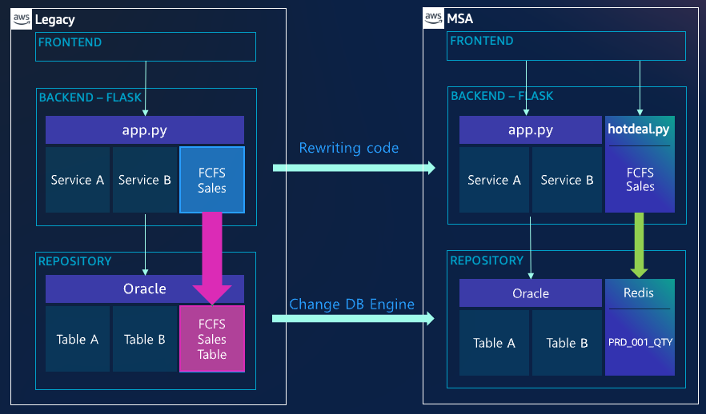

# Workshop03(Accelerate Limited Offer using REDIS)

**Welcome to Workshop3**

**You will migrate repository from Oracle to REDIS for `LIMITED OFFER`** **event**.

**You will see the new appliation with REDIS performance increase from this workshop.**

---

Architecture Diagram



---

## Scenario 

```
You are a leader to lead DBAs and developers. 

Your game is using Oracle for Login, Manager, Log, SHOP and Auction services. 
Gamers love your game, and active users grows rapily, and this result in overhaed in DB server.

Recently, you had big event - LIMITED ITEM OFFER -, many gamers wanted to buy the item same time and it caused heavy performance degradation.
And many gamers were not able to buy ITEM because of performance degradation, and they are very unhappy now.
Your team figured out root case of issue, and it caused by HOT BLOCK in quantity table in Oracle.
You must resolve the issue before 2nd big event is coming. 

How you gonna resolve this issue?
Luckily, you have good team members, they suggested you to replace quantity table to in-memory DB.

% Hot Blocks are happened a lot in RDBMS world. This happens when many session repeatedly accesss one or a few blocks that protected by lock mechanism. To resolve hot block, DBA sometimes consider to use "hash partitioned reverse index" but sometimes it doesn't work.


```

---

# Open 4 new session in MobaXTerm

---


1. Connecting to Oracle (double click or Execute)


---

2. Open 4 new Session


---

3. Session Rename - `Oracle`,` Redis`, `APP`, `ApacheBench`


---

4. Connecting to MobaXterm, then use **Oracle** session to **execute** the following statements to initialize data in Oracle

```
ec2-user@ip-10-100-1-101:/home/ec2-user> sudo su -
Last login: Tue Jan 25 08:14:31 UTC 2022 on pts/1
root@ip-10-100-1-101:/root# su - oracle
Last login: Mon Feb  7 04:55:48 UTC 2022
oracle@ip-10-100-1-101:/home/oracle> sqlplus oshop/oshop

SQL*Plus: Release 11.2.0.2.0 Production on Mon Feb 7 05:26:23 2022
Copyright (c) 1982, 2011, Oracle.  All rights reserved.

Connected to:
Oracle Database 11g Express Edition Release 11.2.0.2.0 - 64bit Production

SQL> @purge
1000 rows updated.
Commit complete.
Table truncated.
SQL> 

```


---

5. Connecting to MobaXterm, then use **Redis** session to **execute** the following statements to initialize data in REDIS

```
ec2-user@ip-10-100-1-101:/home/ec2-user> redis-cli
127.0.0.1:6379> auth Welcome1234
OK
127.0.0.1:6379> set prod-001-quantity 3000
OK
127.0.0.1:6379> get prod-001-quantity
"3000"
127.0.0.1:6379>

```


---

6. **Execute** the following commands in **APP** session in MobaXterm, to run **Legacy Flask application** using **Oracle**.

```
ec2-user@ip-10-100-1-101:/home/ec2-user> cd workshop03/legacy
ec2-user@ip-10-100-1-101:/home/ec2-user/workshop03/legacy> source bin/activate
(legacy) ec2-user@ip-10-100-1-101:/home/ec2-user/workshop03/legacy> flask run --host=0.0.0.0
 * Environment: production
   WARNING: This is a development server. Do not use it in a production deployment.
   Use a production WSGI server instead.
 * Debug mode: off
 * Running on all addresses.
   WARNING: This is a development server. Do not use it in a production deployment.
 * Running on http://10.100.1.101:5000/ (Press CTRL+C to quit)

```


---

7. Now **Game ITEM LIMITED OFFER** event begins.  

   You are going to use **ApacheBench** Session to simulate customer requests.
   
   You are going to simluate with 150 active users to buy 3000 limited items and will check the performacne. 
   
   **Execute** the following **ab** command in **ApacheBench** session in MobaXterm
   
   **In order to process 3000 item selling, the legacy application with Oracle needed approx. 100secs.**

```
ec2-user@ip-10-100-1-101:/home/ec2-user> ab -c 150 -n 3000 http://10.100.1.101:5000/order
This is ApacheBench, Version 2.3 <$Revision: 1430300 $>
Copyright 1996 Adam Twiss, Zeus Technology Ltd, http://www.zeustech.net/
Licensed to The Apache Software Foundation, http://www.apache.org/

Benchmarking 10.100.1.101 (be patient)
Completed 300 requests
Completed 600 requests
Completed 900 requests
Completed 1200 requests
Completed 1500 requests
Completed 1800 requests
Completed 2100 requests
Completed 2400 requests
Completed 2700 requests
Completed 3000 requests
Finished 3000 requests


Server Software:        Werkzeug/2.0.2
Server Hostname:        10.100.1.101
Server Port:            5000

Document Path:          /order
Document Length:        4 bytes

Concurrency Level:      150
Time taken for tests:   100.827 seconds
Complete requests:      3000
Failed requests:        0
Write errors:           0
Total transferred:      468000 bytes
HTML transferred:       12000 bytes
Requests per second:    29.75 [#/sec] (mean)
Time per request:       5041.344 [ms] (mean)
Time per request:       33.609 [ms] (mean, across all concurrent requests)
Transfer rate:          4.53 [Kbytes/sec] received


```


---

8. Go back to **APP** session in MobaXterm, then terminate **legacy application** to press **CTRL+C**. 


---

9. Now, you are going to use new application using REDIS instead of Oracle to check remaining ITEM quantity. 

   In order to do new test, need to initiailze Oracle order table. 

   **Go back to step 4** to initialize Oracle order table then **go to step 10**. 

   ---

   

10. Let's compare **legacy code to use `select for update` to check quantity** and **new code to use REDIS**. 

    Please take a look the codes. 

```
# Legacy ORDER application with Oracle
# The code includes database credential for convinience in workshop.
# In real world, it's better to use AWS Secrect Manager to protect credential. 
# You just give proper IAM role to application(EC2) and use retrieve method, without HARD-CODED credential in your application.

@app.route('/order', methods=['GET'])
def order():
    conn=cx_Oracle.connect("oshop/oshop@10.100.1.101:1521/XE")
    cursor=conn.cursor() 
    sql="select quantity from HOTDEAL_LIST where PROD_ID = 1 for update"
    output=0
    rs = cursor.execute(sql)
    for record in rs:
        currVal = record[0]
        if(currVal > 0):
            currVal = currVal - 1
            update_sql = "update HOTDEAL_LIST set quantity="+str(currVal)+" where PROD_ID=1"
            cursor.execute(update_sql)
            insert_sql = "insert into ORDER_HISTORY values (sysdate, 1,1)"
            cursor.execute(insert_sql)
            paymentProcess()
            conn.commit()

            return str(currVal)
        else:
            return "Out Of Stock"

    cursor.close()
    conn.close()
    return "Completed"

```

```
# New ORDER application with REDIS
# The application uses prod-001-quantity in REDIS instead of HOTDEAL_LIST table in oracle to check quantity
# The code includes database credential for convinience in workshop.
# You just give proper IAM role to application(EC2) and use retrieve method, without HARD-CODED credential in your application.

@app.route('/order-redis', methods=['GET'])
def order_redis():
    conn=cx_Oracle.connect("oshop/oshop@10.100.1.101:1521/XE")
    r = redis.Redis(host='localhost',port=6379,password='XXXXXXX')
    # You can use following statements when you want to use ElastiCache REDIS
    #r = redis.StrictRedis(host='redis-test2.h3rll4.0001.apn2.cache.amazonaws.com',port=6379,db=0)
    cursor=conn.cursor() 
    currVal = int(r.get('prod-001-quantity'))
    output=0
   # rs = cursor.execute(sql)
    print('START')
    if(currVal > 0):
        r.decr('prod-001-quantity',1)
        insert_sql = "insert into ORDER_HISTORY values (sysdate, 1,1)"
        cursor.execute(insert_sql);
        paymentProcess()
        conn.commit()

        return str(currVal)
    else:
        print("Out of Stock")
        return "Out Of Stock"

    cursor.close()
    conn.close()
    return "Completed"

```

---

11. **Execute** the following commands to run **New  application with REDIS**.

```
(legacy) ec2-user@ip-10-100-1-101:/home/ec2-user/workshop1/legacy>  cd ../msa/
(legacy) ec2-user@ip-10-100-1-101:/home/ec2-user/workshop1/msa> source bin/activate
(msa) ec2-user@ip-10-100-1-101:/home/ec2-user/workshop1/msa> flask run --host=0.0.0.0
 * Environment: production
   WARNING: This is a development server. Do not use it in a production deployment.
   Use a production WSGI server instead.
 * Debug mode: off
 * Running on all addresses.
   WARNING: This is a development server. Do not use it in a production deployment.
 * Running on http://10.100.1.101:5000/ (Press CTRL+C to quit)

```

---

12. Now **2nd Game ITEM LIMITED OFFER** event begins.  

    You are going to use **ApacheBench** Session to simulate customer requests.

    You are going to simluate with 150 active users to buy 3000 limited items and will check the performacne. 
    
    **Execute** the following **ab** command in **ApacheBench** session in MobaXterm
    
    **In order to process 3000 item selling, the new application with redis needed approx. 25secs.**

```
ec2-user@ip-10-100-1-101:/home/ec2-user> ab -c 150 -n 3000 http://10.100.1.101:5000/order-redis
This is ApacheBench, Version 2.3 <$Revision: 1430300 $>
Copyright 1996 Adam Twiss, Zeus Technology Ltd, http://www.zeustech.net/
Licensed to The Apache Software Foundation, http://www.apache.org/

Benchmarking 10.100.1.101 (be patient)
Completed 300 requests
Completed 600 requests
Completed 900 requests
Completed 1200 requests
Completed 1500 requests
Completed 1800 requests
Completed 2100 requests
Completed 2400 requests
Completed 2700 requests
Completed 3000 requests
Finished 3000 requests


Server Software:        Werkzeug/2.0.2
Server Hostname:        10.100.1.101
Server Port:            5000

Document Path:          /order-redis
Document Length:        12 bytes

Concurrency Level:      150
Time taken for tests:   24.927 seconds
Complete requests:      3000
Failed requests:        0
Write errors:           0
Total transferred:      495000 bytes
HTML transferred:       36000 bytes
Requests per second:    120.35 [#/sec] (mean)
Time per request:       1246.356 [ms] (mean)
Time per request:       8.309 [ms] (mean, across all concurrent requests)
Transfer rate:          19.39 [Kbytes/sec] received

```


---


```
As you can see the result,
the old legacy application with Oracle took 100secs, 
the new application with REDIS took 25secs. 

Performance of new application with in-memory db increased 4 times than legacy.

As you can see the code, the applicaiton code changes were very small.


```

---

```
% In this workshop, we are using same server for both of Oracle and REDIS to reduce cost.
% You can use standalone for DEV/Test env, it's better to use ElasiCache or MemoryDB for Redis
% to secure HA, Security, auto backup and operational excellence in Production env.

```

---

[Go to next Workshop - workshop04(Migrating an order service using DynamoDB) ](../workshop04/workshop04.md) 


