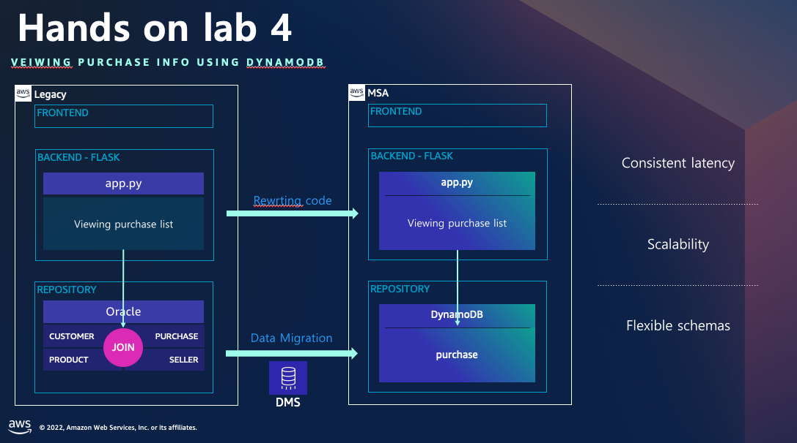
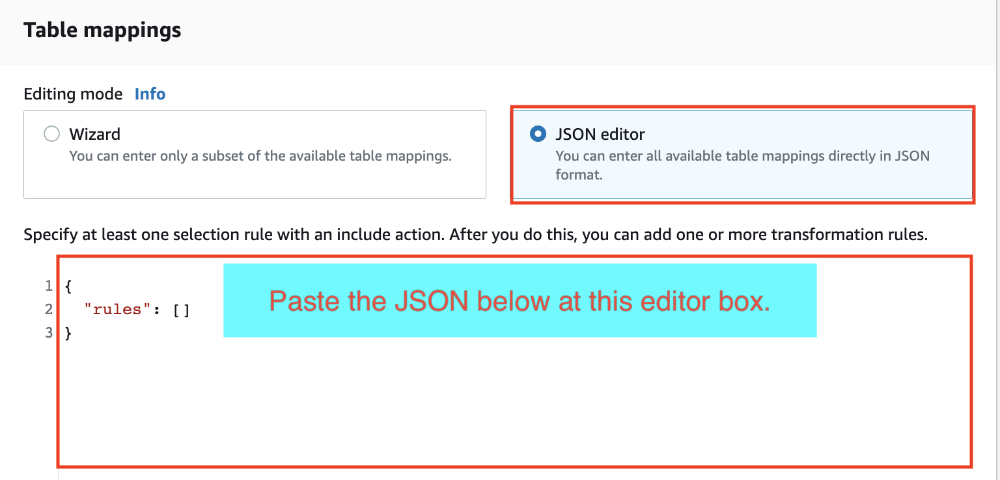
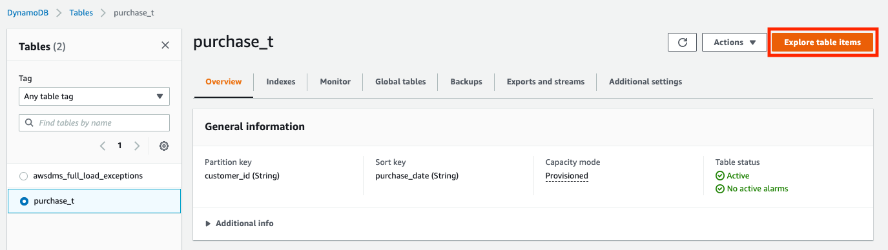

# Workshop04(Migrating an order service using DynamoDB)


**Welcome to the Workshop04. In this workshop, You will learn how to migrate data from Oracle to DynamdoDB using DMS**   

---

### Architecture Diagram

---

### User story

```
You are responsible for database for order service. 

The order service uses Oracle database to store its data.
Data is stored in several tables normalized and each table has relationships with other tables.
To generate order list information, Joining several tables is needed.

As the service becomes more popular, the load on the system is increasing.
You have plan for migrating data from Oracle to DynamoDB to prepare the expansion of the service.
```
---

# Opne three MobaXterm sessions.

1. You can find the way how to make a session at the Workshop01.
2. Change the name of session. (`Oracle`, `Legacy_server`, `MSA_server`)


---

# Oracle to DynamoDB migration

### 1. Check Oracle data
Connect the oracle database via sqldeveloper. Click the sqldeveloper icon.
   
   
Connect `oracle-oshop` database.
   

---

Execute the queries below at the worksheet and check data   

The first query returns the purchase list.   
As you know you should join multiple tables to see purchase list in relational database.   
   
The second query makes pivoted data from the result of the first query.   
And the result of it will be used as the source data for migration to DynamoDB.   

``` sql
SELECT  c.customerid, pc.purchaseid, purchaseseq, pd.productname, pd.price, pc.quantity, s.telnumber, pc.purchasedate, c.name, c.address
FROM purchase pc
	INNER JOIN customer c
	ON pc.customerid = c.customerid
	INNER JOIN product pd
	ON pc.productid = pd.productid
    INNER JOIN seller s
    ON pd.sellerid = s.sellerid
where pc.purchaseid=1;
```
  

``` sql
SELECT  c.customerid, pc.purchaseid, pc.purchasedate, c.name, c.address,
        MAX(case when purchaseseq = 1 then purchaseseq else 0 end) PURCHASE_SEQ_1,
        MAX(case when purchaseseq = 1 then pd.productname else '' end) PRODUCT_NAME_1,
        MAX(case when purchaseseq = 1 then pd.price else 0 end) PRODUCT_PRICE_1,
        MAX(case when purchaseseq = 1 then pc.quantity else 0 end) QUANTITY_1,
        MAX(case when purchaseseq = 1 then s.telnumber else '' end) SELLER_TEL_NUMBER_1,
        MAX(case when purchaseseq = 2 then purchaseseq else 0 end) PURCHASE_SEQ_2,
        MAX(case when purchaseseq = 2 then pd.productname else '' end) PRODUCT_NAME_2,
        MAX(case when purchaseseq = 2 then pd.price else 0 end) PRODUCT_PRICE_2,
        MAX(case when purchaseseq = 2 then pc.quantity else 0 end) QUANTITY_2,
        MAX(case when purchaseseq = 2 then s.telnumber else '' end) SELLER_TEL_NUMBER_2,
        MAX(case when purchaseseq = 3 then purchaseseq else 0 end) PURCHASE_SEQ_3,
        MAX(case when purchaseseq = 3 then pd.productname else '' end) PRODUCT_NAME_3,
        MAX(case when purchaseseq = 3 then pd.price else 0 end) PRODUCT_PRICE_3,
        MAX(case when purchaseseq = 3 then pc.quantity else 0 end) QUANTITY_3,
        MAX(case when purchaseseq = 3 then s.telnumber else '' end) SELLER_TEL_NUMBER_3
FROM purchase pc
	INNER JOIN customer c
	ON pc.customerid = c.customerid
	INNER JOIN product pd
	ON pc.productid = pd.productid
    INNER JOIN seller s
    ON pd.sellerid = s.sellerid
where pc.purchaseid=1
group by c.customerid, pc.purchaseid, pc.purchasedate, c.name, c.address;
```
   

---

### 2. Create a new table for saving the result of data pivoted
Execute the query below in sqldeveloper   
~~~ sql
CREATE TABLE "OSHOP"."PURCHASE_DYNAMODB_FORMAT" 
(
    "CUSTOMER_ID" VARCHAR2(20 BYTE),
    "PURCHASE_ID" VARCHAR2(20 BYTE), 
    "PURCHASE_DATE" VARCHAR2(10 BYTE),
    "CUSTOMER_NAME" VARCHAR2(10 BYTE),    
    "CUSTOMER_ADDRESS" VARCHAR2(100 BYTE),
    "PURCHASE_SEQ_1" VARCHAR2(20 BYTE), 
    "PRODUCT_NAME_1" VARCHAR2(100 BYTE), 
    "PRODUCT_PRICE_1" VARCHAR2(20 BYTE), 
    "QUANTITY_1" VARCHAR2(20 BYTE), 
    "SELLER_TEL_NUMBER_1" VARCHAR2(20 BYTE), 
    "PURCHASE_SEQ_2" VARCHAR2(20 BYTE), 
    "PRODUCT_NAME_2" VARCHAR2(100 BYTE), 
    "PRODUCT_PRICE_2" VARCHAR2(20 BYTE), 
    "QUANTITY_2" VARCHAR2(20 BYTE), 
    "SELLER_TEL_NUMBER_2" VARCHAR2(20 BYTE), 
    "PURCHASE_SEQ_3" VARCHAR2(20 BYTE), 
    "PRODUCT_NAME_3" VARCHAR2(100 BYTE), 
    "PRODUCT_PRICE_3" VARCHAR2(20 BYTE), 
    "QUANTITY_3" VARCHAR2(20 BYTE), 
    "SELLER_TEL_NUMBER_3" VARCHAR2(20 BYTE), 
    CONSTRAINT "PURCHASE_DYNAMODB_FT_PK" PRIMARY KEY ("CUSTOMER_ID", "PURCHASE_ID")
);

INSERT INTO PURCHASE_DYNAMODB_FORMAT
SELECT  c.customerid, pc.purchaseid, pc.purchasedate, c.name, c.address,
        MAX(case when purchaseseq = 1 then purchaseseq else 0 end) PURCHASE_SEQ_1,
        MAX(case when purchaseseq = 1 then pd.productname else '' end) PRODUCT_NAME_1,
        MAX(case when purchaseseq = 1 then pd.price else 0 end) PRODUCT_PRICE_1,
        MAX(case when purchaseseq = 1 then pc.quantity else 0 end) QUANTITY_1,
        MAX(case when purchaseseq = 1 then s.telnumber else '' end) SELLER_TEL_NUMBER_1,
        MAX(case when purchaseseq = 2 then purchaseseq else 0 end) PURCHASE_SEQ_2,
        MAX(case when purchaseseq = 2 then pd.productname else '' end) PRODUCT_NAME_2,
        MAX(case when purchaseseq = 2 then pd.price else 0 end) PRODUCT_PRICE_2,
        MAX(case when purchaseseq = 2 then pc.quantity else 0 end) QUANTITY_2,
        MAX(case when purchaseseq = 2 then s.telnumber else '' end) SELLER_TEL_NUMBER_2,
        MAX(case when purchaseseq = 3 then purchaseseq else 0 end) PURCHASE_SEQ_3,
        MAX(case when purchaseseq = 3 then pd.productname else '' end) PRODUCT_NAME_3,
        MAX(case when purchaseseq = 3 then pd.price else 0 end) PRODUCT_PRICE_3,
        MAX(case when purchaseseq = 3 then pc.quantity else 0 end) QUANTITY_3,
        MAX(case when purchaseseq = 3 then s.telnumber else '' end) SELLER_TEL_NUMBER_3
FROM purchase pc
	INNER JOIN customer c
	ON pc.customerid = c.customerid
	INNER JOIN product pd
	ON pc.productid = pd.productid
    INNER JOIN seller s
    ON pd.sellerid = s.sellerid
group by c.customerid, pc.purchaseid, pc.purchasedate, c.name, c.address;

COMMIT;
~~~
 

---

### 3. Migrating data from Oracle to DynamoDB using DMS

You don't need to create a new replication instance. `Just use the one you already made during the first workshop.`

Create source and target endpoints in [DMS Console](https://ap-northeast-2.console.aws.amazon.com/dms/v2/home?region=ap-northeast-2#dashboard) after preparing a replication instance,

At the left menu, move to the `Endpoints` and click the `Create endpoint`.   
Refer to the blow and enter the values   
```
* Endpoint type : Choose `Source endpoint`
* Endpoint identifier : `s-seoulsummit-endpoint`
* Source engine : `Oracle`
* Access to endpoint database : Choose `Provide access information manually`
* Server name : `10.100.1.101`
* Port : `1521`
* User name : `oshop`
* Password : `oshop`
* SID/Service name : `xe`   
```


Choose VPC and Replication Instance   
Click `Run test`   
If the status become `successful`, click `Create endpoint`


---

Click `Create endpoint` button to create the target endpoint.   
Refer to the information below.   
```
* Endpoint type : Target endpoint
* Endpoint identifier : t-seoulsummit-dynamodb1
* Target engine : Amazon DynamoDB
* Service access role ARN : arn:aws:iam::[Account no(12 digits number)]:role/EC2SSMRole2 
```

***(참고) You should set a specific role at `Service access role ARN` when the target engine is Amazon DynamoDB in DMS. The role was already created and you can check the ARN at the Outputs tab in [CloudFormation](https://ap-northeast-2.console.aws.amazon.com/cloudformation/home?region=ap-northeast-2#/stacks?filteringStatus=active&filteringText=&viewNested=true&hideStacks=false).***


Run connection test.   


Next, create a task.   
Move to the [Task](https://ap-northeast-2.console.aws.amazon.com/dms/v2/home?region=ap-northeast-2#tasks) and click `Create task` button.

Set the values at the `Task configuration`. Please refer the ReplicationInstance at the [CloudFormation](https://ap-northeast-2.console.aws.amazon.com/cloudformation/home?region=ap-northeast-2#/stacks/outputs?filteringStatus=active&filteringText=&viewNested=true&hideStacks=false&stackId=arn%3Aaws%3Acloudformation%3Aap-northeast-2%3A389498866763%3Astack%2FDBforMSA%2Fd0315a00-1ee6-11ed-a34b-06c206b00c16) outputs tab.   
Enter the Source and Target endpoint as the endpoint you created in the previous step.   

```
* Task Identifier : task-seoulsummit-oracle-dynamodb
* Replication instance : ri-oracle-to-mongodb
* Source database endpoint : s-seoulsummit-endpoint
* Target database endpoint : t-seoulsummit-dynamodb1
* Migration type : Migrate existing data
```


Set `Task settings`   


Set `Table mappings`   
Choose JSON editor and enter the JSON below at the JSON editor.   

~~~json
{
    "rules": [
        {
            "rule-type": "selection",
            "rule-id": "1",
            "rule-name": "1",
            "object-locator": {
                "schema-name": "OSHOP",
                "table-name": "PURCHASE_DYNAMODB_FORMAT"
            },
            "rule-action": "include"
        },
        {
            "rule-type": "object-mapping",
            "rule-id": "2",
            "rule-name": "TransformToDDB",
            "rule-action": "map-record-to-record",
            "object-locator": {
                "schema-name": "OSHOP",
                "table-name": "PURCHASE_DYNAMODB_FORMAT"
            },
            "target-table-name": "purchase_t",
            "mapping-parameters": {
                "partition-key-name": "customer_id",
                "sort-key-name": "purchase_id",
                "exclude-columns": [
                    "CUSTOMER_ID",
                    "PURCHASE_DATE",
                    "PURCHASE_ID",
                    "CUSTOMER_NAME",
                    "CUSTOMER_ADDRESS",
                    "PURCHASE_SEQ_1",
                    "PRODUCT_NAME_1",
                    "PRODUCT_PRICE_1",
                    "QUANTITY_1",
                    "SELLER_TEL_NUMBER_1",
                    "PURCHASE_SEQ_2",
                    "PRODUCT_NAME_2",
                    "PRODUCT_PRICE_2",
                    "QUANTITY_2",
                    "SELLER_TEL_NUMBER_2",
                    "PURCHASE_SEQ_3",
                    "PRODUCT_NAME_3",
                    "PRODUCT_PRICE_3",
                    "QUANTITY_3",
                    "SELLER_TEL_NUMBER_3"
                ],
                "attribute-mappings": [
                    {
                        "target-attribute-name": "customer_id",
                        "attribute-type": "scalar",
                        "attribute-sub-type": "string",
                        "value": "${CUSTOMER_ID}"
                    },
                    {
                        "target-attribute-name": "purchase_id",
                        "attribute-type": "scalar",
                        "attribute-sub-type": "string",
                        "value": "${PURCHASE_ID}"
                    },
                    {
                        "target-attribute-name": "purchase_details",
                        "attribute-type": "document",
                        "attribute-sub-type": "dynamodb-map",
                        "value": {
                            "M": {
                                "CUSTOMER_NAME": {
                                    "S": "${CUSTOMER_NAME}"
                                },
                                "CUSTOMER_ADDRESS": {
                                    "S": "${CUSTOMER_ADDRESS}"
                                },
                                "PRODUCT_NAME_1": {
                                    "S": "${PRODUCT_NAME_1}"
                                },
                                "PRODUCT_PRICE_1": {
                                    "S": "${PRODUCT_PRICE_1}"
                                },
                                "QUANTITY_1": {
                                    "S": "${QUANTITY_1}"
                                },
                                "SELLER_TEL_NUMBER_1": {
                                    "S": "${SELLER_TEL_NUMBER_1}"
                                },
                                "PRODUCT_NAME_2": {
                                    "S": "${PRODUCT_NAME_2}"
                                },
                                "PRODUCT_PRICE_2": {
                                    "S": "${PRODUCT_PRICE_2}"
                                },
                                "QUANTITY_2": {
                                    "S": "${QUANTITY_2}"
                                },
                                "SELLER_TEL_NUMBER_2": {
                                    "S": "${SELLER_TEL_NUMBER_2}"
                                },
                                "PRODUCT_NAME_3": {
                                    "S": "${PRODUCT_NAME_3}"
                                },
                                "PRODUCT_PRICE_3": {
                                    "S": "${PRODUCT_PRICE_3}"
                                },
                                "QUANTITY_3": {
                                    "S": "${QUANTITY_3}"
                                },
                                "SELLER_TEL_NUMBER_3": {
                                    "S": "${SELLER_TEL_NUMBER_3}"
                                }
                            }
                        }
                    }
                ]
            }
        }
    ]
}
~~~

Choose `Manually later` and click `Create task` button.   


Run the task.     


Migrating 100,000 rows took 14m 13s.   


Move to the [DynamoDB](https://ap-northeast-2.console.aws.amazon.com/dynamodbv2/home?region=ap-northeast-2#tables) and click `purchase_t`.


Choose `purchase_t` and click `Explore table items`.


You can see the data migrated from Oracle.   


Click one of items and check the details of it.


----

# Test searching purchase list in Oracle and DynamoDB

---
### 1. Run the lagacy application
Move to the `Legacy_server` Session in MobaXterm and execute the commands below.
~~~
ec2-user@ip-10-100-1-101:/home/ec2-user> cd workshop04/legacy
ec2-user@ip-10-100-1-101:/home/ec2-user/workshop04/legacy> source bin/activate
(legacy) ec2-user@ip-10-100-1-101:/home/ec2-user/workshop04/legacy> flask run --host=0.0.0.0 --port=4000
 * Environment: production
   WARNING: This is a development server. Do not use it in a production deployment.
   Use a production WSGI server instead.
 * Debug mode: off
 * Running on all addresses.
   WARNING: This is a development server. Do not use it in a production deployment.
 * Running on http://10.100.1.101:4000/ (Press CTRL+C to quit)
~~~
---

### 2. (Oracle)Generate searching purchase list requests using Gatling.
Execute the commands below in Bastion Server(Windows server)


~~~
C:\Users\Administrator> CD C:\gatling\bin
C:\gatling\bin> gatling.bat
GATLING_HOME is set to "C:\gatling"
JAVA = "java"
Choose a simulation number:
     [0] SeoulSummit.Workshop02_legacy
     [1] SeoulSummit.Workshop02_msa
     [2] SeoulSummit.Workshop04_legacy
     [3] SeoulSummit.Workshop04_msa
2(Enter)
Select run description (optional)
(Enter)
Simulation SeoulSummit.Workshop04_legacy started...

================================================================================
2022-03-06 20:42:11                                           5s elapsed
---- Requests ------------------------------------------------------------------
> Global                                                   (OK=114    KO=0     )
> selectPurchase                                           (OK=114    KO=0     )

---- Workshop04_legacy ---------------------------------------------------------
          active: 2      / done: 114
================================================================================
~~~
You can see the result of the test. The average latency of p95 is 92ms.   
   

Open the link above in the web brower.   


Move to `Legacy_server` Session in MobaXterm and enter ctrl+C to stop the lagacy application.
~~~
10.100.1.103 - - [07/Apr/2022 15:05:29] "GET /legacy/selectPurchase HTTP/1.1" 200 -
^C(legacy) ec2-user@ip-10-100-1-101:/home/ec2-user/workshop04/legacy>
~~~
---
### 3. (DynamoDB)Generate requests for searching purchase list.
Move to the `MSA_Server` session in `MobaXterm` and run application.   
~~~
ec2-user@ip-10-100-1-101:/home/ec2-user> cd workshop04/msa
ec2-user@ip-10-100-1-101:/home/ec2-user/workshop04/msa> source bin/activate
(msa) ec2-user@ip-10-100-1-101:/home/ec2-user/workshop04/msa> flask run --host=0.0.0.0 --port=4000
 * Environment: production
   WARNING: This is a development server. Do not use it in a production deployment.
   Use a production WSGI server instead.
 * Debug mode: off
 * Running on all addresses.
   WARNING: This is a development server. Do not use it in a production deployment.
 * Running on http://10.100.1.101:4000/ (Press CTRL+C to quit)
~~~


Generate requests using Gatling.   
The test performed for 10 minutes.
Execute the commands below in Bastion Server(Windows server)


~~~
C:\Users\Administrator> CD C:\gatling\bin
C:\gatling\bin> gatling.bat
GATLING_HOME is set to "C:\gatling"
JAVA = "java"
Choose a simulation number:
     [0] SeoulSummit.Workshop02_legacy
     [1] SeoulSummit.Workshop02_msa
     [2] SeoulSummit.Workshop04_legacy
     [3] SeoulSummit.Workshop04_msa
3(Enter)
Select run description (optional)
(Enter)
Simulation SeoulSummit.Workshop04_msa started...

================================================================================
2022-03-06 20:51:06                                           5s elapsed
---- Requests ------------------------------------------------------------------
> Global                                                   (OK=219    KO=0     )
> selectPurchase                                           (OK=219    KO=0     )

---- Workshop04_msa ------------------------------------------------------------
          active: 2      / done: 219
================================================================================
~~~
You can see the result of the test. The average latency of p95 is 56ms.   


Open the link above in the web brower.   


Check the [Cloudwatch metric](https://ap-northeast-2.console.aws.amazon.com/dynamodbv2/home?region=ap-northeast-2#table?initialTagKey=&name=purchase_t&tab=monitoring).  
Zoom in the `Get latency` metric in the latency category.   


As time goes by, the response time decreases and remains stable at 2ms.

---

~~~
You have done migrating data from Oracle to DynamodBD using DMS.

DynamoDB supports single-digit millisecond read and write performance at any scale.
The schemaless nature of DynamoDB enables fast and flexibel application development.
~~~

---

[To the next - workshop99(Cleansing the workshop resource) ](../workshop99/workshop99.md) 

